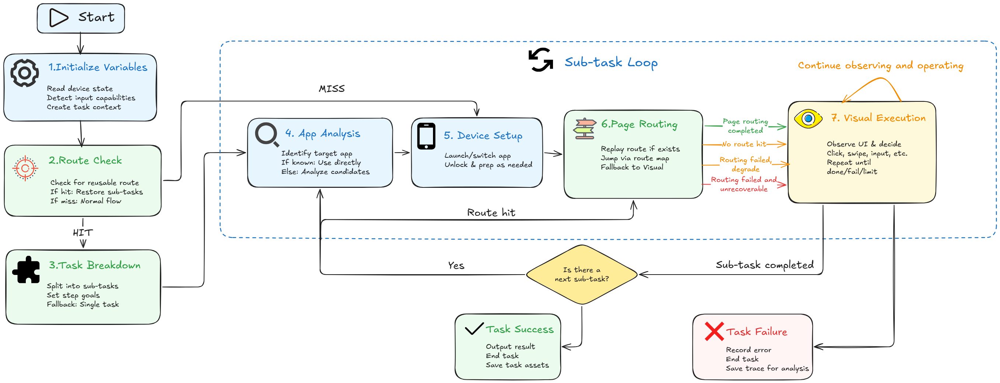

# Task Overview

The Tasks page provides three main entries: **Quick tasks**, **Scheduled tasks**, and **Notification-triggered tasks**. A common workflow is to try a task as a quick task first, then turn it into a scheduled or notification-triggered task after it works.

## Task execution flow

The following diagram shows the general flow from task start to finish. As a user, you do not need to memorize every internal state. The important idea is: AutoLXB prepares the device and task context, tries to reuse a task route for stable page navigation, then uses the vision model for dynamic UI decisions.

In plain words:

1. **Preparation**: read device state, app state, input capability, and runtime context.
2. **Route check**: if this task has a saved route, AutoLXB tries to use it first.
3. **Normal execution**: if there is no route or the route cannot be used, AutoLXB analyzes the task, opens the target app, and navigates normally.
4. **Visual execution**: when the current page must be understood or operated, the vision model observes the screen and chooses actions.
5. **Finish or fail**: after completion, the result is recorded. If it fails, inspect Trace for the reason.

## Which task type should I use?

| Task type | Best for | Example |
| --- | --- | --- |
| Quick task | Temporary execution, trial runs, model testing | "Open WeChat and send hello to File Transfer." |
| Scheduled task | Run at a fixed time or repeatedly | Open an app and check in every morning at 9:00. |
| Notification-triggered task | Run after a matching notification arrives | Reply after receiving a message from a specific chat. |

## Recommended workflow

1. **Try it as a quick task first**: confirm that the model understands the task and the phone can click, swipe, and input normally.
2. **Automate it after it is stable**: create a scheduled task or notification-triggered task.
3. **Save a route after a successful run**: route reuse can reduce model calls and improve repeatability.
4. **Use Trace when something fails**: Trace shows which phase failed and why.

## Task routes in one sentence

A task route is a reusable local path generated from a successful task run. Later runs of the same task can replay the route first, and only fall back to visual execution when the route cannot finish the job.
